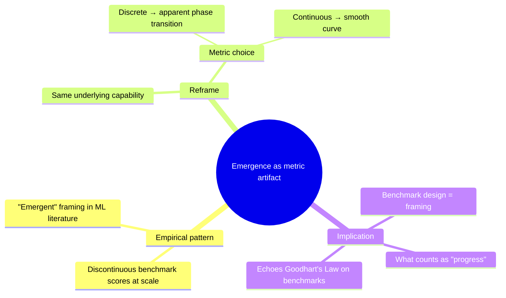

# study-this (chat) — Worked example

One end-to-end chat session showing the flow. The user has already done first-run setup (chose Notion, the Learning Vault database is connected). This is their second article.

---

## Ingest

**User pastes:**

> Recent work on large language models has found that performance on certain tasks exhibits a sharp phase transition as model size increases — capabilities that are absent or near-random in small models appear seemingly out of nowhere at scale. Researchers have called this 'emergence' and treated it as a discontinuous, qualitative shift. But more recent analysis suggests the phenomenon is at least partly an artifact of the metrics used: when smooth, continuous metrics are substituted, the apparent discontinuity disappears…

**Agent:**

Got it. Querying your Learning Vault for related entries while I process this — you have 3 prior entries to compare against.

### Pass A — What the article claims

- Some LLM capabilities appear to emerge discontinuously as a function of scale.
- The "emergence" framing treats this as a qualitative, threshold-crossing phenomenon.
- When the metric is changed from discrete to continuous, the discontinuity often vanishes.
- This suggests at least some of "emergence" is a measurement artifact, not a property of the models.
- The finding complicates how the field talks about capability acquisition and benchmark design.

### Pass B — My extensions (agent — not in the article)

- *Analogy.* This pattern also shows up in psychometrics — apparent "developmental stages" smoothing into gradients when finer scales are used.
- *Suggested follow-up.* Schaeffer et al., "Are Emergent Abilities of Large Language Models a Mirage?" (NeurIPS 2023).
- *Cross-domain framing.* The argument is really about the asymmetry between the measurement function and the underlying capability — a recurring trap in any field with threshold-based metrics.

### Claims for cross-linking

- Apparent capability "emergence" in LLMs is at least partly a metric artifact, not a model property.
- Discrete metrics manufacture apparent phase transitions where continuous metrics show smooth trends.
- Benchmark design shapes what counts as "progress," not just what we measure.

### Tags + concepts

[AskUserQuestion]
**Use these tags and concepts?**

| Option | What's in it |
|---|---|
| ✅ Yes, all of them | tags: `ml`, `evaluation`, `epistemics` · concepts: `emergence`, `phase-transition`, `metric-artifact`, `benchmark-design` |
| ✏️ Let me edit | You'll type your changes in the next message |
| ➕ Add my own | Free-form additions |

*(User picks "Yes, all of them".)*

> Tag note: I checked your existing tags — `ml` and `epistemics` already exist in your vault. Reused them. `evaluation` is new.

### Related past entries

Found one strong claim-shape match:

- **[On Goodhart's Law in ML Benchmarks](notion://...)** (2026-04-22) — your prior entry argued benchmarks become targets and lose validity. This one argues that even the *discontinuity structure* of benchmarks is a design choice. Adjacent moves in the same epistemological space.

[AskUserQuestion]
**Weave this into the quiz?**

| Option | Effect |
|---|---|
| ✅ Yes | At least one quiz question will link the two pieces |
| Skip | Stay focused on this article alone |

*(User picks "Yes".)*

### Concept map

Persisting entry to your Learning Vault in Notion — created page "Emergence as Metric Artifact" with all fields populated.

[AskUserQuestion]
**Quiz you on this now?**

| Option |
|---|
| ✅ Yes |
| Not now |

*(User picks "Yes".)*

---

## Quiz

[AskUserQuestion]
**How do you want to be quizzed?**

| Option | What it covers |
|---|---|
| Quick recall | Fast factual checks, lightest load |
| Deep synthesis | Adversarial open-ended, defend your answers |
| ⭐ Mixed (recommended) | Balanced blend of both |

*(User picks "Mixed".)*

---

**Q1 (assumption-surfacing).** [TEXT] The piece treats "emergence" as the *default* framing the field reached for. But [ME] that framing is doing real work — it lets researchers tell a story of qualitative capability acquisition. **What would the field have to give up if "emergence" turned out to be entirely a metric artifact?**

**User:** They'd have to give up the idea that there's a meaningful threshold where the model "gets it." It'd undermine the case for ever-larger models.

**Agent:** [ME] That's the surface answer — the "scaling justification" implication. **What's the second-order effect?** Researchers reach for emergence because it lets them claim *something interesting happened*. If emergence dissolves, what's left to publish about — and how does that change which experiments get funded?

**User:** I see — it's about narrative incentives. Without the discontinuity, scaling stories get boring.

**Agent:** [TEXT] Right — and the article hints at this when it says the finding "complicates how the field talks about capability acquisition." [ME] But it doesn't follow the implication through to publishing incentives. That's my extension, not the article's.

**User:** move on

---

**Q2 (cross-link with Goodhart entry).** [TEXT] This article argues benchmark *shape* determines what we see as emergence. [TEXT] Your prior entry on Goodhart argued benchmarks lose validity once they become targets. **Are these the same argument, or different mechanisms producing similar conclusions?**

**User:** Different mechanisms. Goodhart is about optimization pressure on a metric corrupting it. This one is about the metric's *structure* creating an illusion before any optimization happens.

**Agent:** [ME] Precise. The Goodhart entry was about measurement under adversarial pressure; this is about measurement under *innocent* pressure. **But here's a harder question** — [ME] if the metric structure creates an illusion *before* optimization, what does Goodhart's framework even apply to? Are we measuring the wrong thing, or measuring the right thing wrong?

**User:** cite?

**Agent:** [TEXT] The article doesn't explicitly distinguish "wrong thing" vs. "wrong way" — that framing was [ME] mine. Downgrading the question's framing to [ME]. The underlying point — that metric structure precedes optimization pressure — is in the article (the line about discontinuity disappearing when the metric changes).

**User:** move on

---

**Q3 (mechanism-probing).** [TEXT] The article asserts that switching from discrete to continuous metrics dissolves the discontinuity. **Why is that mechanically true — what about a discrete metric *creates* the appearance of a phase transition where there isn't one?**

**User:** A discrete metric has a threshold built into it. The model's underlying probability of producing the right token can change smoothly from 0.3 → 0.5 → 0.7, but if you only score "did it get it exactly right?", you see nothing happen until probability crosses ~0.5. The discontinuity is in the *scoring function*, not the model.

**Agent:** [ME] Exactly right — the cleanest mechanical explanation. **One last push:** [ME] does this mean any discrete-metric benchmark is suspect, or are there cases where discrete is the *correct* lens?

**User:** Maybe in tasks where the *real-world consequence* is discrete — like "did the code compile or not." There's no smooth version of that.

**Agent:** [TEXT] The article doesn't address this — focuses on the artifact case. [ME] Your distinction is the missing nuance: discrete metrics are honest when the underlying consequence is discrete, suspicious when it's continuous. Worth saving — adding that to the entry's "My extensions" section.

---

## Wrap

Three questions, three typology types (assumption-surfacing, cross-link, mechanism-probing), one cross-link satisfied (Q2). Q&A appended to your Notion entry under `## Quiz transcript ### 2026-05-15 — mixed mode`.

**What you actually internalized** (from your answers, not mine): metric structure is a framing choice that precedes optimization pressure — and the distinction between "wrong thing" vs. "wrong way" of measuring is the natural extension the article doesn't make. That's the load-bearing idea to keep.

---

## What this example is demonstrating

- **AskUserQuestion at choice points only** — tag confirmation, weave-in opt-in, quiz mode pick. Not for the actual Q&A, which is normal long-form chat.
- **Mermaid renders inline** — the chat surface shows the diagram, not raw code.
- **Cross-link is grounded in claim shape**, not tag overlap. The Goodhart entry came up because both pieces are about "the measurement function shapes what we see," even though their mechanisms differ.
- **`[TEXT]` / `[ME]` labels on every agent claim during quiz.** No exceptions.
- **`cite?` triggers a real check** — Q2 the agent honestly downgrades.
- **`move on` is honored immediately** — no arguing with the escape.
- **Notion persistence** — the entry is a real page in the database, queryable later.
