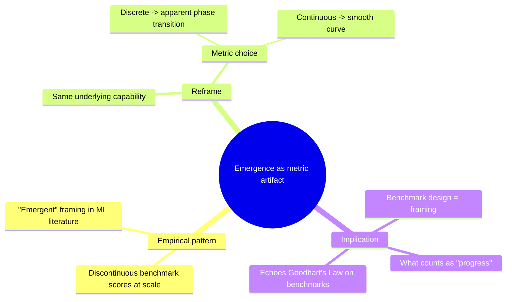

# study-this — Worked example

One fully worked session, end to end. Use this as a template for what "good" looks like.

The user pastes an excerpt from a hypothetical essay on emergent capabilities in large language models. The example is condensed for length; real sessions are longer.

---

## Session start

**User:**
```
/study "Recent work on large language models has found that performance on certain tasks
exhibits a sharp phase transition as model size increases — capabilities that are absent
or near-random in small models appear seemingly out of nowhere at scale. Researchers have
called this 'emergence' and treated it as a discontinuous, qualitative shift. But more
recent analysis suggests the phenomenon is at least partly an artifact of the metrics
used: when smooth, continuous metrics are substituted, the apparent discontinuity
disappears. This complicates the standard story of capability acquisition and raises
questions about how we should be measuring progress at all."
```

**Agent:**

Got it. Running ingest. The vault has 3 prior entries — I'll cross-link if there's claim-shape overlap.

### Pass A — What the article claims

- Empirical observation: some LLM capabilities appear to emerge discontinuously as a function of scale.
- The "emergence" framing treats this as a qualitative, threshold-crossing phenomenon.
- When the metric is changed from a discrete (e.g. exact match) to a continuous one (e.g. log-likelihood), the discontinuity often vanishes.
- This suggests at least some of "emergence" is a measurement artifact, not a property of the models.
- The finding complicates how the field talks about capability acquisition and benchmark design.

### Pass B — My extensions (agent — not in the article)

- *Analogy.* This pattern — apparent phase transitions dissolving under finer measurement — also shows up in psychometrics (e.g. apparent "developmental stages" smoothing into gradients when finer scales are used).
- *Suggested follow-up.* Schaeffer et al., "Are Emergent Abilities of Large Language Models a Mirage?" (NeurIPS 2023); critiques of stage theories in developmental psychology.
- *Cross-domain framing.* The argument is really about the asymmetry between **the measurement function** and **the underlying capability** — a recurring trap in any field where threshold-based metrics dominate (think: clinical psychiatry's DSM categories).

### Claims for INDEX.md

- Apparent capability "emergence" in LLMs is at least partly a metric artifact, not a model property.
- Discrete metrics manufacture apparent phase transitions where continuous metrics show smooth trends.
- Benchmark design choices shape what we *see* as progress, not just what we *measure*.

### Proposed tags + concepts

- **Tags:** `ml`, `evaluation`, `epistemics`
- **Concepts:** `emergence`, `phase-transition`, `metric-artifact`, `benchmark-design`

(I checked INDEX.md — `ml` and `epistemics` already exist; reused them. `evaluation` is new.)

Confirm or adjust?

**User:** Looks good.

### Related past entries

Found a match in your vault:

- **[2026-04-22 — On Goodhart's Law in ML Benchmarks](entries/2026-04-22-goodharts-law-ml-a3c.md)** — claims overlap in shape: *"the measurement function shapes what 'progress' even means."* That entry argued benchmarks become targets and lose validity; this one argues that *even the discontinuity structure* of benchmarks is a choice. Adjacent moves in the same epistemological space.

### Concept map



Persisting entry to `~/learning-vault/entries/2026-05-15-emergence-as-metric-artifact-b7e.md`, appending to INDEX.md, syncing to Notion.

Want me to quiz you now?

---

## Quiz session

**User:** yes, mixed

**Agent:**

Mixed mode. 4–6 questions, drawing from ≥3 typology types. I'll push back at least once per question. Drop a line any time with `move on`.

---

**Q1 (assumption-surfacing).** [TEXT] The piece treats "emergence" as the *default* framing the field reached for. But [ME] that framing is doing real work — it lets researchers tell a story of qualitative capability acquisition that maps onto how humans talk about expertise. **What would the field have to give up if "emergence" turned out to be entirely a metric artifact?**

**User:** They'd have to give up the idea that there's a meaningful threshold where the model "gets it." It'd undermine the case for ever-larger models, since the gains would look more continuous than dramatic.

**Agent:** [ME] That's the surface answer — the "scaling justification" implication. **What's the second-order effect?** Researchers reach for the emergence framing because it lets them claim *something interesting happened*. If emergence dissolves, what's left to publish about — and how does that change which experiments get funded?

**User:** I see — it's about narrative incentives. Without the discontinuity, scaling stories get boring.

**Agent:** [TEXT] Right — and the article hints at this when it says the finding "complicates how the field talks about capability acquisition." [ME] But it doesn't follow the implication through to publishing incentives. That's outside the article's scope.

`move on`?

**User:** yes

---

**Q2 (cross-link with past entry — Goodhart).** [TEXT] This article argues benchmark *shape* (discrete vs. continuous) determines what we see as emergence. [TEXT] Your prior entry on Goodhart's Law argued benchmarks lose validity once they become targets. **Are these the same argument, or different mechanisms producing similar conclusions?**

**User:** Different mechanisms. Goodhart is about optimization pressure on a metric corrupting it. This one is about the metric's *structure* (discrete vs. continuous) creating an illusion before any optimization happens.

**Agent:** [ME] Precise. The Goodhart entry was about measurement under adversarial pressure; this is about measurement under *innocent* pressure (just trying to score honestly). **But here's a harder question** — [ME] if the metric structure creates an illusion *before* optimization, what does Goodhart's framework even apply to? Are we measuring the wrong thing, or measuring the right thing wrong?

**User:** cite?

**Agent:** [TEXT] The article doesn't explicitly distinguish "wrong thing" vs. "wrong way" — that framing was [ME] mine. Downgrading the question's framing to [ME]. The underlying point — that metric structure precedes optimization pressure — is in the article (the line about discontinuity disappearing when the metric changes).

`move on`?

**User:** move on

---

**Q3 (mechanism-probing).** [TEXT] The article asserts that switching from discrete to continuous metrics dissolves the discontinuity. **Why is that mechanically true — what about a discrete metric *creates* the appearance of a phase transition where there isn't one?**

**User:** Because a discrete metric (like exact match) has a threshold built into it. The model's underlying probability of producing the right token can change smoothly from 0.3 → 0.5 → 0.7, but if you only score "did it get it exactly right?", you see nothing happen until probability crosses ~0.5. The discontinuity is in the *scoring function*, not the model.

**Agent:** [ME] Exactly right — and that's the cleanest mechanical explanation I can give. **One last push:** [ME] does this mean any discrete-metric benchmark is suspect, or are there cases where discrete is the *correct* lens?

**User:** Maybe in tasks where the *real-world consequence* is discrete — like, "did the code compile or not." There's no smooth version of that.

**Agent:** [TEXT] The article doesn't address this — it focuses on the artifact case. [ME] Your distinction is the missing nuance: discrete metrics are honest when the underlying consequence is discrete (compilation, win/loss), suspicious when the consequence is continuous (quality, partial credit). Worth saving.

---

**Q4 (stakeholder-flipping).** [ME] Who in the ML community is *helped* by the article's framing, and who is *hurt*?

**User:** Helped: empiricists who like clean metrics and reproducibility, since the article gives them a tool to cut through narrative inflation. Hurt: anyone whose research program leans on emergence as a phenomenon — capability researchers, interpretability folks tracking "phase transitions" in models.

**Agent:** [ME] Good — but you missed one. [ME] **Frontier labs.** Their pitch to capital often leans on "watch what emerges at the next scale." If emergence is a metric story, the marketing case for $1B training runs gets weaker. Different stakeholder, different stakes. *That's* the second-order effect.

---

**Wrap.**

Four questions, three types (assumption-surfacing, cross-link/mechanism, stakeholder-flipping), one cross-link to your Goodhart entry. The Q&A above gets appended to `## Quiz transcript ### 2026-05-15 — mixed mode` in the entry, and the entry re-syncs to Notion.

What you actually internalized (from your own answers, not mine): **metric structure is a framing choice that precedes optimization pressure** — and the distinction between "wrong thing" vs. "wrong way" of measuring isn't in the article but is the natural extension. That's the load-bearing idea to keep.

---

## What this example is showing

- Pass A is short and *only* claims from the text.
- Pass B is clearly labelled and physically separated.
- The cross-link to a past entry is grounded in claim-shape similarity, not tag overlap.
- The concept map uses `mindmap` because the content shape is structural (components of an argument).
- Every agent claim during the quiz is `[TEXT]` or `[ME]`.
- The user uses `cite?` once — the agent honestly downgrades a framing to `[ME]`.
- The user uses `move on` twice — agent immediately advances.
- The cross-link mandate is satisfied (Q2).
- The wrap focuses on what the *user* said, not what the agent generated — that's the durable artifact.
